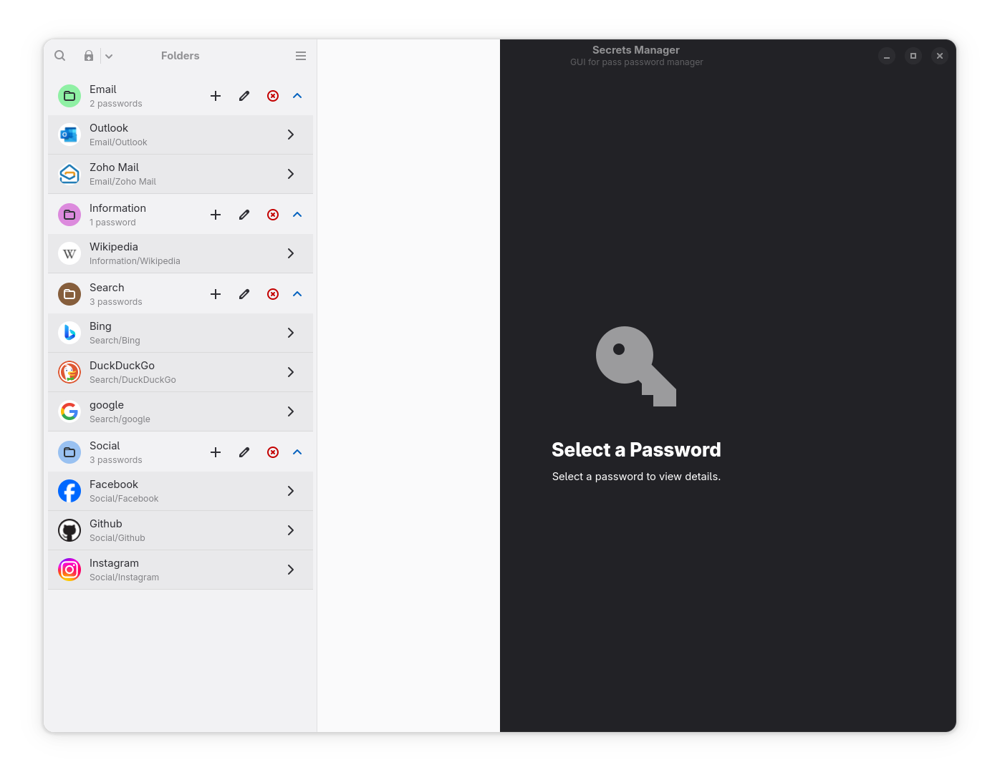
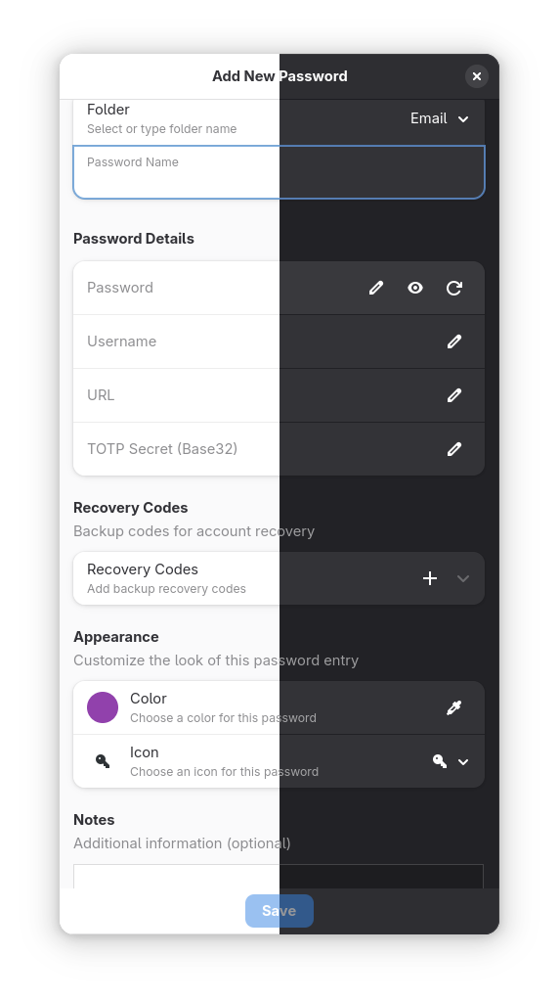
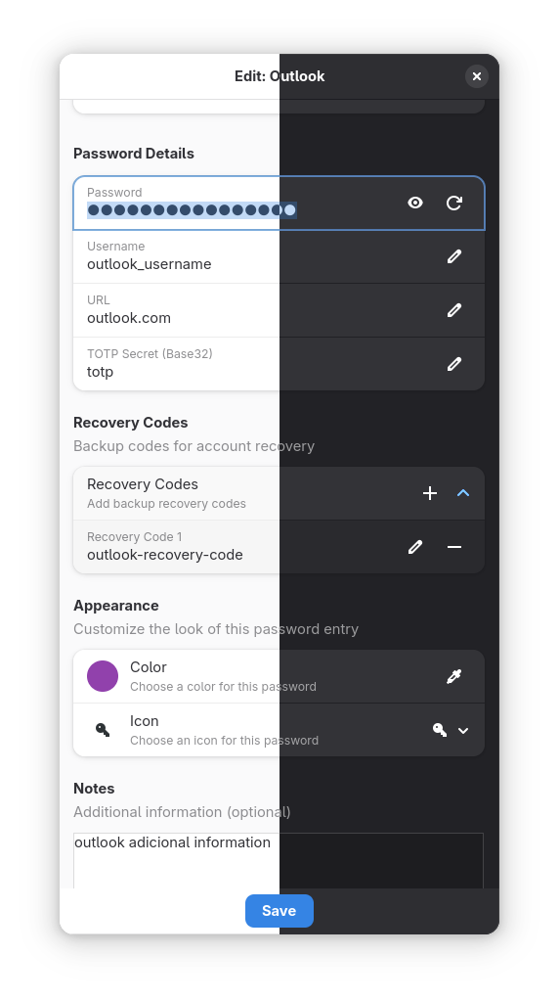
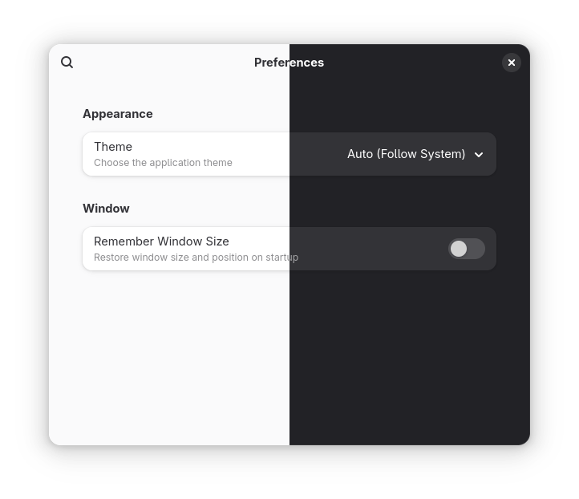
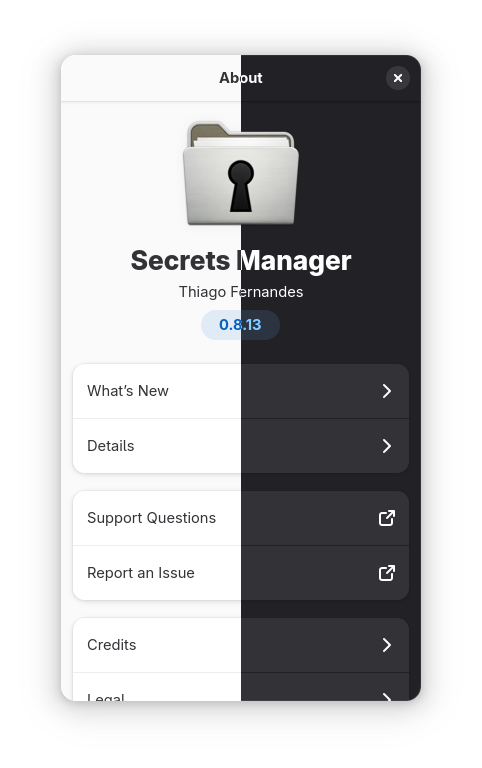

# Secrets - A GTK4/Libadwaita GUI for pass

Secrets is a modern desktop application that provides a clean and user-friendly graphical interface for managing your passwords with `pass`, the standard unix password manager. It leverages the power and security of `pass`, GPG, and Git, wrapped in a beautiful GTK4/Libadwaita UI.

## 🆕 What's New in v0.8.7

### Git Functionality Management & UI Cleanup
- **Complete Git feature removal** - All Git functionality temporarily disabled for stable release
- **Clean user interface** - Removed Git buttons, menu items, and settings from all UI components
- **Streamlined preferences** - Git settings page removed from preferences dialog
- **Enhanced stability** - Application runs without Git dependencies or non-functional features
- **Future-ready codebase** - All Git code preserved with comments for v0.9.x restoration

### User Experience Improvements
- **Simplified interface** - Focus on core password management without confusing disabled features
- **Consistent behavior** - No broken Git buttons or menu items that don't work
- **Better performance** - Reduced overhead from disabled Git monitoring and status checking
- **Cleaner navigation** - Streamlined menus and settings without placeholder functionality

## ✨ Features

### 🔐 **Password Management**
- **Hierarchical folder organization** with expandable tree view
- **Add, edit, delete, and move** password entries
- **Structured password fields**: username, password, URL, notes, TOTP
- **TOTP support** with live 6-digit codes and countdown timers
- **Recovery codes management** for 2FA backup
- **Password generator** with customizable options and strength indicator
- **Copy to clipboard** with automatic clearing for security

### 🔍 **Search & Navigation**
- **Full-text search** across all password content
- **Real-time filtering** as you type
- **Keyboard shortcuts** for efficient navigation
- **Quick access** to frequently used passwords

### 🎨 **Modern Interface**
- **GTK4/Libadwaita design** following GNOME HIG
- **Adaptive layout** with split-view navigation
- **Dark/light theme support** with system integration
- **Toast notifications** for user feedback
- **Responsive design** that works on different screen sizes

### 🔧 **Advanced Features**
- **Advanced Git integration** with platform support and repository management
- **Intelligent setup wizard** with automatic GPG/pass detection and guided configuration
- **Enhanced setup experience** with improved completion flow and verified icon
- **Flatpak compatibility** with enhanced GPG environment setup
- **Import/export** functionality (JSON, CSV formats)
- **Comprehensive preferences** with security settings
- **Automatic clipboard clearing** for enhanced security
- **Internationalization** support for multiple languages

### 🌐 **Git Integration & Platform Support**
- **Multi-platform support**: GitHub, GitLab, Codeberg, and custom Git servers
- **Repository setup wizard** with guided configuration
- **Automatic repository detection** and status monitoring
- **Real-time Git status** with ahead/behind indicators
- **Auto-commit and auto-push** options for seamless synchronization
- **Repository management** through preferences with setup and status dialogs
- **Git history viewer** with commit details and author information
- **Conflict detection** and branch management
- **Platform API integration** for repository validation and information
- **Conditional UI elements** - Git buttons only appear when Git is properly configured

### 🔒 **Security Features**
- **Automatic idle locking** - Lock application after configurable inactivity period
- **Master password timeout** - Require re-entering GPG passphrase periodically
- **Failed attempt protection** - Lockout after too many failed unlock attempts
- **Memory clearing** - Clear sensitive data from memory when locked
- **Screen lock integration** - Lock application when system screen locks
- **Configurable timeouts** - Auto-hide passwords and clear clipboard
- **Export security** - Require master password for data export operations
- **Session management** - Comprehensive security controls in preferences

### 🧙 **Setup Wizard**
- **Intelligent dependency detection** - Automatically detects installed components (pass, GPG keys)
- **Guided GPG key creation** - Step-by-step GPG key generation with form validation
- **Password store initialization** - Automatic password store setup with proper GPG key association
- **Cross-session compatibility** - Handles GPG key detection even when app is reopened
- **Enhanced completion flow** - Improved setup completion with custom verified icon
- **User-friendly experience** - Setup wizard stays open after completion, only closes on cancellation

### ⌨️ **Keyboard Shortcuts**
- `Ctrl+N` - Add new password
- `Ctrl+E` - Edit password
- `Ctrl+C` - Copy password
- `Ctrl+Shift+C` - Copy username
- `Ctrl+F` - Focus search
- `Ctrl+G` - Generate password
- `Ctrl+Shift+P` - Git pull
- `Ctrl+Shift+U` - Git push
- `Ctrl+Shift+S` - Git status dialog
- `Ctrl+Shift+G` - Git setup dialog
- `Ctrl+,` - Preferences
- `F5` - Refresh

## 📸 Screenshots

### Main Interface

*Main application window with hierarchical password organization*


*Password details view with TOTP support and structured fields*

### Dialogs and Features

*Add new password dialog with comprehensive field options*


*Edit password dialog with comprehensive field options*

### Settings and Configuration

*Git integration settings with multi-platform support*


*Advanced security settings with session management*


*General application preferences*

### Additional Features

*Git status and repository information*


*Keyboard shortcuts help dialog*


*About dialog with application information*

## 🔒 Security

Secrets provides comprehensive security features to protect your sensitive data:

### Session Security
- **Idle Lock**: Automatically lock the application after a configurable period of inactivity (1-120 minutes)
- **Screen Lock Integration**: Lock application when the system screen locks
- **Master Password Timeout**: Require re-entering GPG passphrase after a configurable period (15-480 minutes, or never)
- **Memory Clearing**: Clear sensitive data from memory when the application is locked

### Access Protection
- **Failed Attempt Lockout**: Lock out users after too many failed unlock attempts (1-10 attempts)
- **Lockout Duration**: Configurable lockout period after failed attempts (1-60 minutes)
- **Secure Unlock Dialog**: Password entry with attempt tracking and countdown display

### Data Protection
- **Auto-hide Passwords**: Automatically hide visible passwords after timeout (5-300 seconds)
- **Clipboard Security**: Automatically clear clipboard after copying sensitive data (10-300 seconds)
- **Export Security**: Require master password confirmation for data export operations
- **Delete Confirmation**: Require confirmation before deleting password entries

### Configuration
All security features are configurable through **Preferences → Security**:
- **Password Display**: Auto-hide settings and timeouts
- **Clipboard**: Auto-clear timeout configuration
- **Session Security**: Idle lock, screen lock, and master password timeouts
- **Advanced Security**: Memory clearing, export protection, and failed attempt settings

### Security Benefits
- **Defense in Depth**: Multiple layers of protection (UI lock + memory clearing + timeouts)
- **User Control**: Balance security vs convenience with configurable settings
- **Automatic Protection**: Passive security that doesn't require user intervention
- **Visual Feedback**: Clear indication of security status and remaining time

## 🌐 Git Integration

Secrets provides comprehensive Git integration for synchronizing your password store across devices and platforms.

### Supported Platforms
- **GitHub** - Full API integration with repository validation
- **GitLab** - Complete GitLab.com and self-hosted support
- **Codeberg** - Gitea-based platform integration
- **Custom Git Servers** - Support for any Git repository

### Git Features
- **Repository Setup Wizard** - Guided setup for new or existing repositories
- **Real-time Status Monitoring** - Live Git status in the header bar
- **Automatic Operations** - Auto-pull on startup, auto-push on changes, auto-commit
- **Visual Indicators** - Git status with ahead/behind commit counts
- **Repository Management** - Complete repository configuration through preferences
- **History Viewer** - Browse commit history with author and date information
- **Conflict Detection** - Visual indication of repository conflicts
- **Platform Integration** - Repository validation using platform APIs

### Git Configuration Options
Available in **Preferences → Git**:

#### Basic Settings
- **Auto-pull on startup** - Automatically pull changes when application starts
- **Auto-push on changes** - Automatically push changes after modifications
- **Show Git status** - Display Git status information in the UI
- **Git timeout** - Timeout for Git operations (5-120 seconds)

#### Advanced Settings
- **Auto-commit on changes** - Automatically commit changes before push/pull
- **Show Git notifications** - Display toast notifications for Git operations
- **Check remote on startup** - Verify remote repository status on application start
- **Custom commit messages** - Configure default commit message template

#### Repository Management
- **Repository Setup** - Configure Git repository and remote connections
- **Repository Status** - View detailed Git status and commit history
- **Platform Integration** - Connect to GitHub, GitLab, or custom Git servers
- **Remote Configuration** - Manage remote URLs and authentication

### Git Workflow
1. **Setup**: Use the Git setup wizard to initialize or connect to a repository
2. **Monitor**: Git status indicator shows current repository state
3. **Sync**: Manual or automatic push/pull operations keep data synchronized
4. **History**: View commit history and repository information
5. **Manage**: Configure Git settings through comprehensive preferences

### Security Considerations
- **GPG Integration** - All Git operations respect GPG configuration
- **Secure Authentication** - Support for SSH keys and HTTPS authentication
- **Token Management** - Secure storage of platform access tokens
- **Conflict Resolution** - Safe handling of merge conflicts and repository issues

## 🌍 Internationalization

Secrets has full internationalization support with automatic locale detection and fallback to English when translations are unavailable.

### Supported Languages

- **🇧🇷 Portuguese (Brazil)** - pt_BR ⚠️ Partial (42% coverage)
- **🇵🇹 Portuguese (Portugal)** - pt_PT ⚠️ Partial (37% coverage)
- **🇺🇸 English (United States)** - en_US ✅ Complete (source)
- **🇬🇧 English (United Kingdom)** - en_GB ✅ Complete (source)
- **🇪🇸 Spanish** - es 👍 Good (79% coverage)
- **🇮🇪 Irish (Gaeilge)** - ga 👍 Good (79% coverage)

### Translation Features

- **Automatic locale detection** - Detects system locale and loads appropriate translations
- **Fallback support** - Falls back to English if translation not available
- **Development support** - Works in both development and installed environments
- **UI integration** - All user-facing strings in dialogs, menus, and interface are translatable
- **UTF-8 encoding** - Proper Unicode support for all languages

### Testing Translations

```bash
# Test specific locale
LANGUAGE=pt_BR python3 -m secrets.main

# Test Spanish interface
LANGUAGE=es ./run-dev.sh
```

### Adding New Translations

1. Add language code to `po/LINGUAS`
2. Create new .po file: `msginit --input=po/secrets.pot --locale=LANG --output=po/LANG.po`
3. Translate strings in the .po file
4. Rebuild: `meson compile -C build`

### Translation File Structure

```
po/
├── LINGUAS              # List of supported languages
├── secrets.pot          # Translation template
├── pt_BR.po            # Portuguese (Brazil) translations
├── pt_PT.po            # Portuguese (Portugal) translations
├── en_GB.po            # English (UK) translations
├── en_US.po            # English (US) translations
├── es.po               # Spanish translations
├── ga.po               # Irish translations
└── meson.build         # Build configuration
```

## 🛠️ Technology Stack

- **Language**: Python 3.8+
- **UI Framework**: GTK4 & Libadwaita with modern design patterns
- **Build System**: Meson & Ninja with comprehensive build automation
- **Dependencies**: PyGObject, pyotp, requests
- **Backend**: `pass`, GnuPG, Git with intelligent integration
- **Packaging**: Flatpak with enhanced GPG environment and setup wizard
- **Architecture**: MVC pattern with specialized managers and service layers

## 📦 Installation

### From Flathub (Recommended)

*Coming soon - the application will be available on Flathub once submitted and approved.*

```bash
flatpak install flathub io.github.tobagin.secrets
flatpak run io.github.tobagin.secrets
```

### Building from Source

#### Prerequisites
- Python 3.8+
- GTK4 and Libadwaita development libraries
- Meson (>= 0.64.0) and Ninja
- `pass`, `git`, and `gpg` installed and configured

#### Build Steps
```bash
# Clone the repository
git clone https://github.com/tobagin/Secrets.git
cd Secrets

# Build with meson
meson setup build
meson compile -C build

# Run for development
./run-dev.sh
```

#### Development Options
```bash
./run-dev.sh                 # Recommended: run with meson devenv
./run-dev.sh --direct        # Run directly without meson
./build/secrets-dev       # Run generated script
python3 -m secrets.main      # Run module directly
```

### Building Flatpak Locally

```bash
# Install flatpak-builder
sudo dnf install flatpak-builder  # Fedora
sudo apt install flatpak-builder  # Ubuntu/Debian

# Build and install
flatpak-builder --user --install --force-clean build io.github.tobagin.secrets.yml

# Run the Flatpak
flatpak run io.github.tobagin.secrets
```

#### Flatpak GPG Compatibility

The Flatpak version includes enhanced GPG environment setup for proper password decryption in sandboxed environments:

- **Automatic GPG environment configuration** - Sets up proper `GPG_TTY`, `GNUPGHOME`, and agent settings
- **GUI pinentry integration** - Includes pinentry-gtk2 for password prompts in the GUI
- **Robust error handling** - Graceful fallbacks when GPG components are missing
- **Seamless operation** - No manual configuration required for GPG operations

### System Installation

```bash
# Build and install system-wide
meson setup build --prefix=/usr
meson compile -C build
sudo meson install -C build

# Run the installed application
io.github.tobagin.secrets
```

## 🏗️ Project Structure

```
src/
├── secrets/                 # Main application package
│   ├── controllers/         # UI controllers and state management
│   ├── managers/            # Business logic managers
│   ├── services/            # Core services (password, git)
│   ├── setup_wizard/        # Setup wizard components
│   ├── ui/                  # UI components and dialogs
│   │   ├── components/      # Reusable UI components
│   │   ├── dialogs/         # Dialog windows
│   │   └── widgets/         # Custom widgets
│   └── utils/               # Utility functions
data/
├── ui/                      # UI template files
├── icons/                   # Application icons
└── screenshots/             # Application screenshots
po/                          # Translation files
scripts/                     # Development and build scripts
```

## 🗺️ Roadmap

### 🔄 Upcoming Features (v0.9.x)
- **🔗 Git Integration** - Full Git synchronization with remote repositories
  - Git push/pull operations with conflict resolution
  - Repository setup and management
  - Commit history and status tracking
  - Platform integration (GitHub, GitLab, etc.)
- **📊 Advanced Analytics** - Password security insights and statistics
- **🔐 Enhanced Security** - Additional encryption options and security features
- **🌐 Cloud Sync** - Alternative synchronization methods beyond Git

### 🎯 Future Enhancements (v1.0+)
- **📱 Mobile Companion** - Mobile app for secure password access
- **🔌 Browser Extension** - Direct browser integration for autofill
- **🏢 Team Features** - Shared password stores for organizations
- **🔄 Advanced Import/Export** - Support for more password managers
- **🎨 Theming System** - Custom themes and appearance options

### 🐛 Known Issues & Improvements
- Performance optimizations for large password stores
- Enhanced search capabilities with advanced filters
- Improved accessibility features
- Better error handling and user feedback

## 📄 License

This project is licensed under the GPL-3.0-or-later License - see the [LICENSE](LICENSE) file for details.